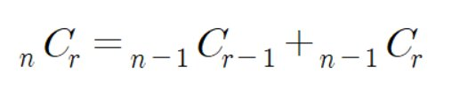

**조합의 경우수(메모이제이션)**

**설명**

로 계산합니다.

하지만 여러분은 이 공식을 쓰지않고 다음 공식을 사용하여 재귀를 이용해 조합수를 구해주는 프로그램을 작성하세요.

**입력**

첫째 줄에 자연수 n(3<=n<=33)과 r(0<=r<=n)이 입력됩니다.

**출력**

첫째 줄에 조합수를 출력합니다.

**Cases**

5 3 
output: 
10

33 19 
output: 
818809200