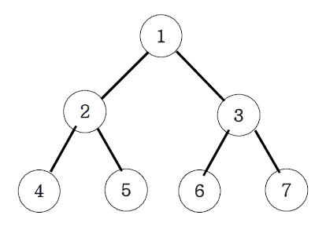

**이진트리 순회(넓이우선탐색 : 레벨탐색)**

**설명**

아래 그림과 같은 이진트리를 전위순회와 후위순회를 연습해보세요.

- 레벨 탐색 순회 출력 : 1 2 3 4 5 6 7

**입력**

첫 줄에 노드의 개수 자연수 N이 입력된다. 다음 줄부터 N개의 행에 부모, 왼쪽 자식, 오른쪽 자식 순서로 공백을 두고 입력된다.

**출력**

전위, 중위, 후위 순으로 위 예시와 동일하게 숫자만 출력하시오.

**Cases**

7 
1 2 3 
2 4 5 
3 6 7 
4 0 0 
5 0 0 
6 0 0 
7 0 0 
output: 
1 2 3 4 5 6 7