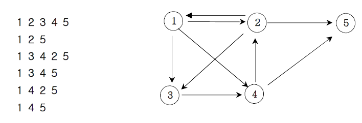

**경로 탐색(인접리스트)**

방향그래프가 주어지면 1번 정점에서 N번 정점으로 가는 모든 경로의 가지 수를 출력하는 프
로그램을 작성하세요. 아래 그래프에서 1번 정점에서 5번 정점으로 가는 가지 수는

총 6 가지입니다.

**입력**

첫째 줄에는 정점의 수 N(1<=N<=20)와 간선의 수 M가 주어진다. 그 다음부터 M줄에 걸쳐 연결정보가 주어진다.

**출력**

총 가지수를 출력한다.

**Cases**

5 9 
1 2 
1 3 
1 4 
2 1 
2 3 
2 5 
3 4 
4 2 
4 5 
output: 
6