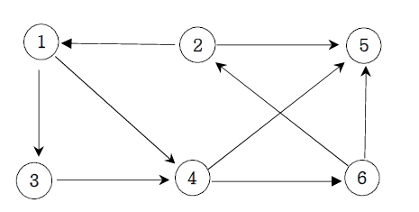

**그래프 최단거리(BFS)**

다음 그래프에서 1번 정점에서 각 정점으로 가는 최소 이동 간선수를 출력하세요.

**입력**

첫째 줄에는 정점의 수 N(1<=N<=20)와 간선의 수 M가 주어진다. 그 다음부터 M줄에 걸쳐 연결정보가 주어진다.

**출력**

1번 정점에서 각 정점으로 가는 최소 간선수를 2번 정점부터 차례대로 출력하세요.

**Cases**

6 9 
1 3 
1 4 
2 1 
2 5 
3 4 
4 5 
4 6 
6 2 
6 5 
output: 
2 : 3 
3 : 1 
4 : 1 
5 : 2 
6 : 2