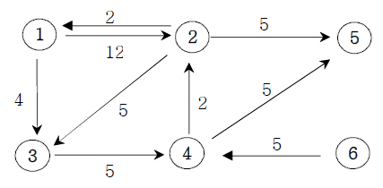

**다익스트라 알고리즘**

**설명**

아래의 가중치 방향그래프에서 1번 정점에서 모든 정점으로의 최소 거리비용을 출력하는 프로그램을 작성하세요. (경로가 없으면 Impossible를 출력한다)

**입력**

첫째 줄에는 정점의 수 N(1<=N<=20)와 간선의 수 M가 주어진다. 그 다음부터 M줄에 걸쳐 연
결정보와 거리비용이 주어진다.

**출력**

1번 정점에서 각 정점으로 가는 최소비용을 2번 정점부터 차례대로 출력하세요.

**Cases**

6 9 
1 2 12 // 1번 정점에서 2번정점으로 가는데 12의 비용이 든다. 
1 3 4 
2 1 2 
2 3 5 
2 5 5 
3 4 5 
4 2 2 
4 5 5 
6 4 5 
output: 
2 : 11 
3 : 4 
4 : 9 
5 : 14 
6 : impossible