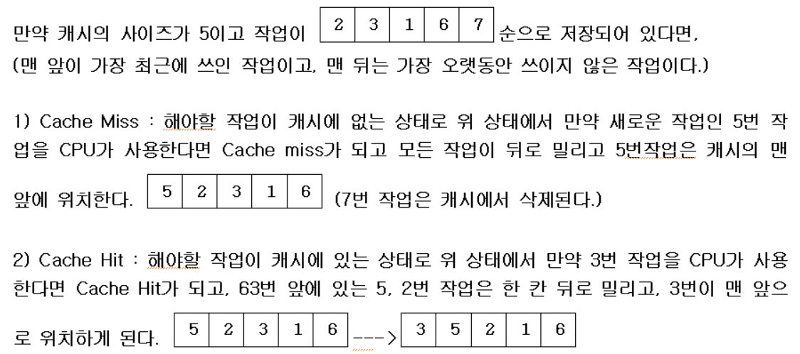
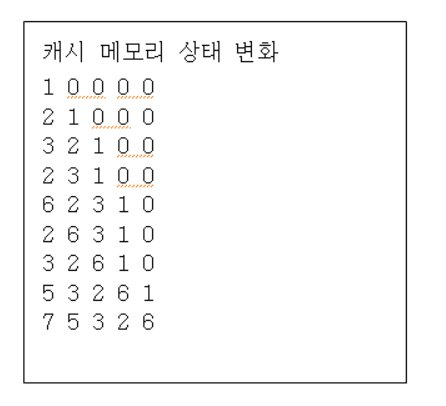

**Least recently used**

**설명**

캐시메모리는 CPU와 주기억장치(DRAM) 사이의 고속의 임시 메모리로서 CPU가 처리할 작업을 저장해 놓았다가

필요할 때 바로 사용해서 처리속도를 높이는 장치이다. 워낙 비싸고 용량이 작아 효율적으로 사용해야 한다.

철수의 컴퓨터는 캐시메모리 사용 규칙이 LRU 알고리즘을 따른다.

LRU 알고리즘은 Least Recently Used 의 약자로 직역하자면 가장 최근에 사용되지 않은 것 정도의 의미를 가지고 있습니다.

캐시에서 작업을 제거할 때 가장 오랫동안 사용하지 않은 것을 제거하겠다는 알고리즘입니다.

캐시의 크기가 주어지고, 캐시가 비어있는 상태에서 N개의 작업을 CPU가 차례로 처리한다면 N개의 작업을 처리한 후

캐시메모리의 상태를 가장 최근 사용된 작업부터 차례대로 출력하는 프로그램을 작성하세요.

**입력**

첫 번째 줄에 캐시의 크기인 S(3<=S<=10)와 작업의 개수 N(5<=N<=1,000)이 입력된다.

두 번째 줄에 N개의 작업번호가 처리순으로 주어진다. 작업번호는 1 ~100 이다.

**출력**

마지막 작업 후 캐시메모리의 상태를 가장 최근 사용된 작업부터 차례로 출력합니다.

**Cases**

5 9 
1 2 3 2 6 2 3 5 7 
output: 
7 5 3 2 6

**힌트**

