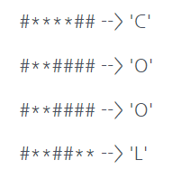

**암호**

**설명**

현수는 영희에게 알파벳 대문자로 구성된 비밀편지를 매일 컴퓨터를 이용해 보냅니다.
비밀편지는 현수와 영희가 서로 약속한 암호로 구성되어 있습니다.
비밀편지는 알파벳 한 문자마다 # 또는 * 이 일곱 개로 구성되어 있습니다.
만약 현수가 “#*****#”으로 구성된 문자를 보냈다면 영희는 현수와 약속한 규칙대로 다음과 같이 해석합니다.

1. “#*****#”를 일곱자리의 이진수로 바꿉니다. #은 이진수의 1로, *이진수의 0으로 변환합니다. 결과는 “1000001”로 변환됩니다.
2. 바뀐 2진수를 10진수화 합니다. “1000001”을 10진수화 하면 65가 됩니다.
3. 아스키 번호가 65문자로 변환합니다. 즉 아스크번호 65는 대문자 'A'입니다.
참고로 대문자들의 아스키 번호는 'A'는 65번, ‘B'는 66번, ’C'는 67번 등 차례대로 1씩 증가하여 ‘Z'는 90번입니다.
현수가 4개의 문자를 다음과 같이 신호로 보냈다면

이 신호를 4개의 문자신호로 구분하면

최종적으로 “COOL"로 해석됩니다.
현수가 보낸 신호를 해석해주는 프로그램을 작성해서 영희를 도와주세요.

**입력**

첫 줄에는 보낸 문자의 개수(10을 넘지 안습니다)가 입력된다. 다음 줄에는 문자의 개수의 일곱 배 만큼의 #또는 * 신호가 입력됩니다.
현수는 항상 대문자로 해석할 수 있는 신호를 보낸다고 가정합니다.

**출력**

영희가 해석한 문자열을 출력합니다.

**Cases**

output: 
COOL